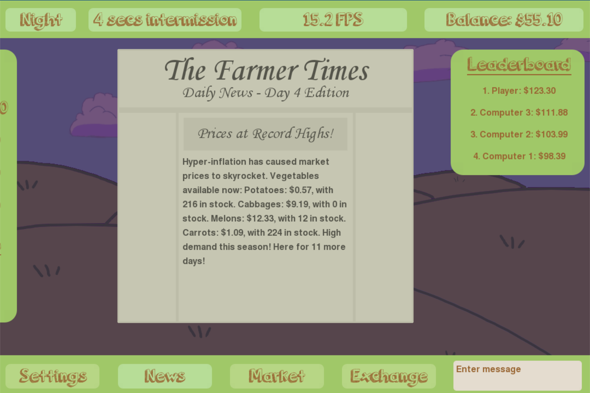

# The Farmer's Market
This is multi-player online market-simulation game by Almutwakel Hassan, with art contributions by Harry Li. 

This was started on April 23, 2020, and last updated August 19, 2020. It uses python with pygame module for the client.

## Gameplay

Players have the option to choose singleplayer or multiplayer modes after pressing play. In singleplayer mode, the player faces 3 computer opponents.

Each day, players will have access to the market menu to buy and sell vegetables, which fluctate in price every night. One unique prediction is provided to you and each other player.

After each round, the market closes and news that will affect the market comes out. Events occur once every 3 rounds, which can dramatically change the state of the game. A leaderboard also appears, showing the net worth of each player.

## Download Link
https://drive.google.com/file/d/1wRfMnXdbiN1J14afgm06iBj0tczNtAov/view?usp=sharing
